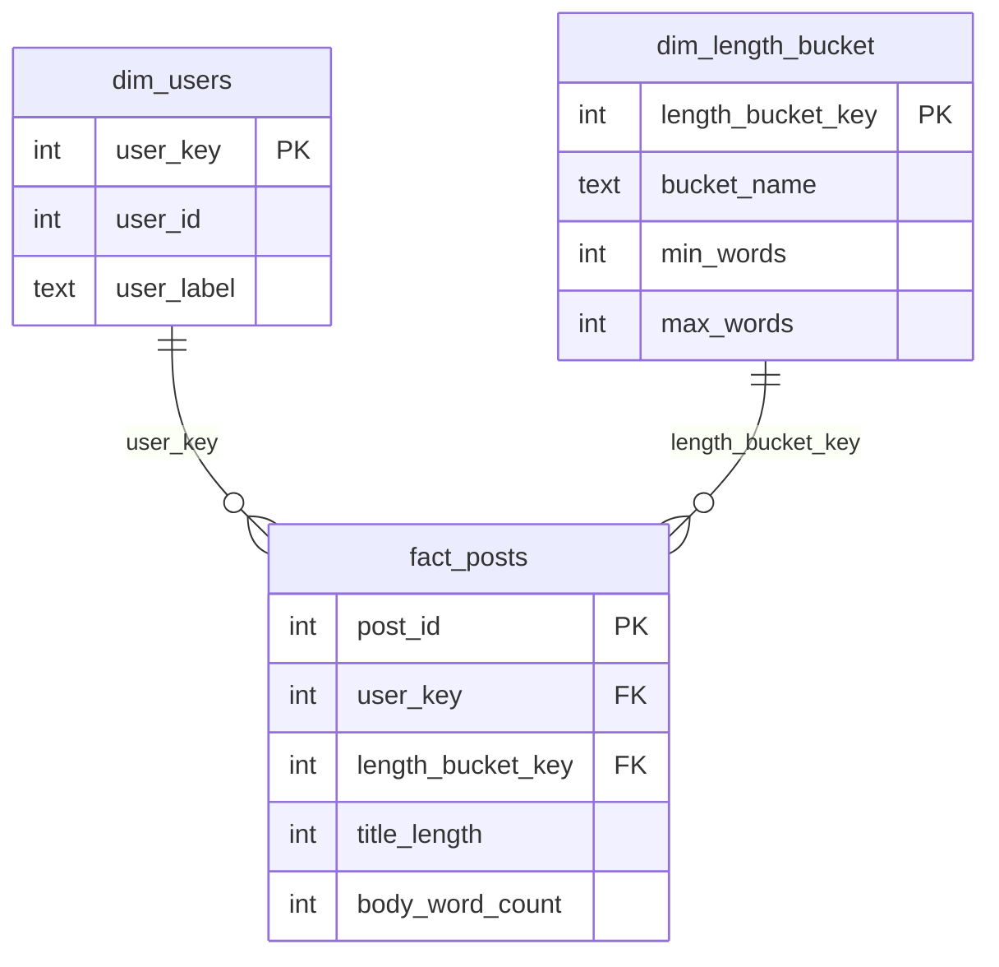

# Data Pipeline: Load, Transform, Model, Quality Gates

Small ELT pipeline using the JSONPlaceholder `/posts` API and SQLite.

```
API -> load.py -> posts (raw) -> transform.py -> stg_posts -> posts_clean
                                                                  |
                       build_warehouse.py: build_* tables -> quality tests -> fact_posts + dim tables
```

## How to run
```bash
pip install -r requirements.txt
python run_pipeline.py     # load (incremental) + transform + model + quality gates, with logging
```
Step by step:
```bash
python load.py             # incremental load into warehouse.db
python transform.py        # staging + final layers (no internet needed)
python build_warehouse.py  # dimensional model + quality gates (no internet needed)
```

## Task 01 - Extract and load
`load.py` pulls `/posts` and writes to `posts` (id, user_id, title, body), then checks the row count.

## Task 02 - Transformation
| Layer | Table | What happens |
|-------|-------|--------------|
| Raw | `posts` | Untouched copy of API data |
| Staging | `stg_posts` | Type casting, trimming, newline cleanup, deduplication on `post_id` |
| Final | `posts_clean` | Analyst table + `title_length`, `body_word_count` |

SQL lives in `sql/` (one file per layer).

## Task 03 - Scheduled and idempotent
- **Same result on re-run:** PRIMARY KEY + `INSERT OR IGNORE`; staging/final tables are rebuilt each run.
- **Incremental:** `load_state` table keeps a watermark (highest id loaded); only newer rows are inserted. Data and watermark are saved in one transaction.
- **Logging:** `pipeline.log` plus a `run_log` table (status, fetched / inserted / skipped, errors).
- **Schedule:** `run_pipeline.bat` with Windows Task Scheduler:
```bat
schtasks /create /tn "PostsPipeline" /tr "C:\full\path\to\run_pipeline.bat" /sc daily /st 09:00
```
or cron: `0 9 * * * cd /path/to/repo && python run_pipeline.py`

## Task 04 - Capstone: warehouse pipeline with quality gates

### Dimensional model

Details of the model and every test: [docs/model.md](docs/model.md)

### Quality gates
- The model is first built as `build_*` tables.
- 8 tests in `quality_tests.py` run on them (not empty, row count matches, no nulls, unique keys, keys exist in dimensions, valid values).
- **Any failed test stops the run (exit code 1)** and the published tables (`fact_posts`, `dim_users`, `dim_length_bucket`) are not touched.
- Only if all tests pass, `build_*` tables are renamed to the published names in one transaction.

### Decisions
- **SQLite** for simplicity (no setup).
- **Watermark on `id`:** API has no `updated_at`; posts are append-only.
- **Build then publish:** tests run on temporary tables, so bad data never reaches the published tables.
- **LEFT JOINs in the fact table** so a missing key becomes NULL and is caught by a test, instead of silently dropping the row.
- **Tests are SQL queries returning bad rows:** easy to read and easy to add new ones.
- **Static bucket dimension:** thresholds (19 / 29 words) are my own simple choice for the demo.
