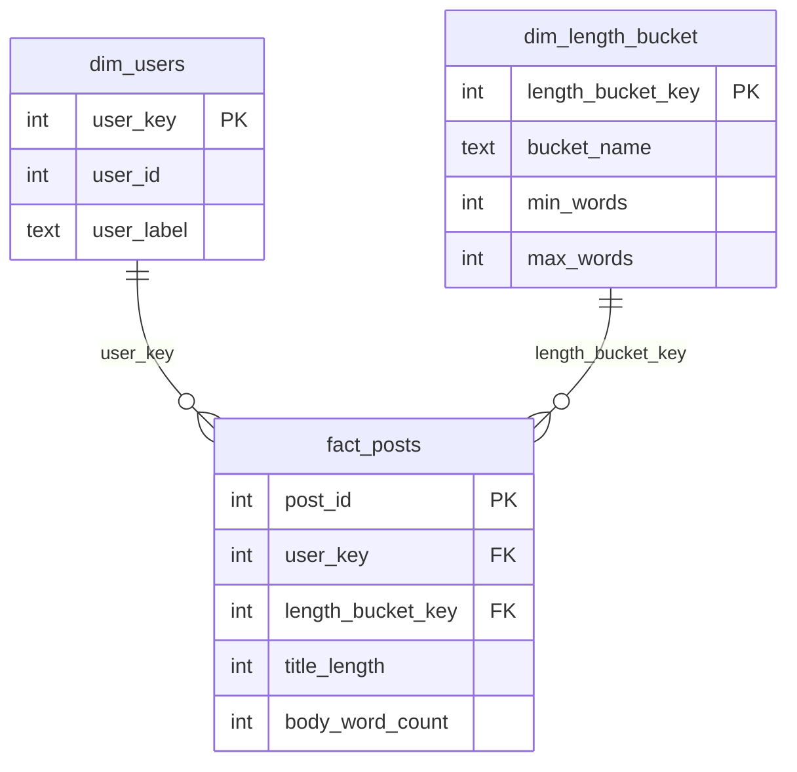

# Data model and quality tests

## Model (star schema)



- **Grain of the fact table:** one row per post.
- **fact_posts** holds the measures (`title_length`, `body_word_count`) and keys to the dimensions.
- **dim_users:** one row per user, with a surrogate key (`user_key`).
- **dim_length_bucket:** small lookup (short 1-19 words, medium 20-29, long 30+).

## How data flows
```
posts (raw) -> stg_posts -> posts_clean -> build_* tables -> [quality tests] -> published tables
```
Model tables are first built as `build_dim_users`, `build_dim_length_bucket`, `build_fact_posts`.
Only if every test passes they are renamed to the real names in one transaction.

## Quality tests (`quality_tests.py`)
Each test is a SQL query that returns bad rows. Any bad row = test fails = pipeline run fails
(exit code 1) and the published tables stay as they were.

| Test | What it checks |
|------|----------------|
| fact_not_empty | fact table has rows |
| fact_row_count_matches_source | fact rows = `posts_clean` rows (nothing lost or duplicated by joins) |
| fact_no_nulls | no NULLs in keys or measures |
| fact_post_id_unique | one fact row per post |
| dim_users_user_id_unique | one dimension row per user |
| fact_user_key_exists_in_dim | every fact `user_key` exists in `dim_users` |
| fact_bucket_key_exists_in_dim | every fact `length_bucket_key` exists in `dim_length_bucket` |
| fact_valid_values | `title_length` and `body_word_count` are > 0 |

## Proving the gate works
```bash
python -c "import sqlite3; c=sqlite3.connect('warehouse.db'); c.execute(\"INSERT INTO posts VALUES (999, 11, '', 'bad row')\"); c.commit()"
python run_pipeline.py        # FAILS: fact_valid_values, nothing published
python -c "import sqlite3; c=sqlite3.connect('warehouse.db'); c.execute('DELETE FROM posts WHERE id=999'); c.commit()"
python run_pipeline.py        # passes again
```
